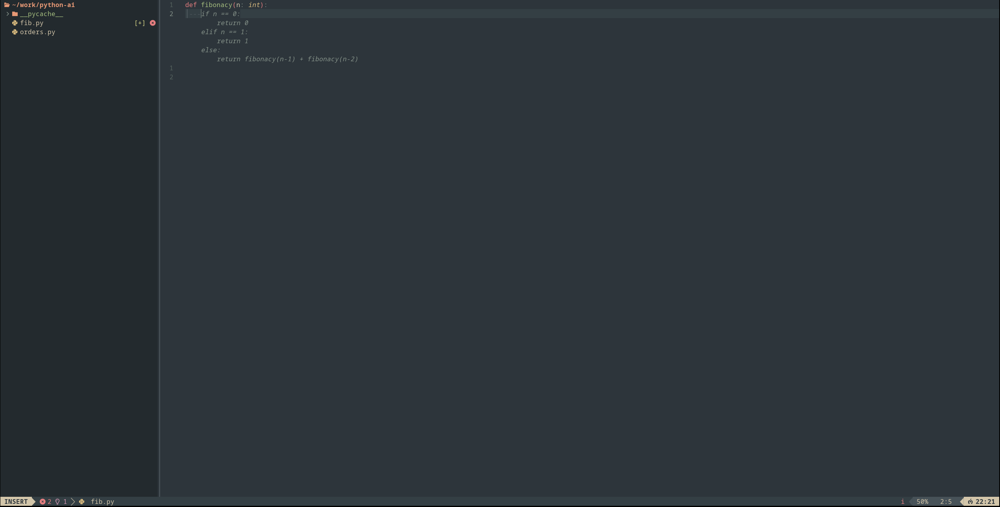

# Neovim Config

A LazyVim-based Neovim setup focused on a clean editing experience, multi-language development, and debugger support — all with fast startup through lazy loading.



## Credits

This config was inspired by the YouTube video
[**0 to LSP: Neovim RC From Scratch**](https://www.youtube.com/watch?v=w7i4amO_zaE)
by ThePrimeagen.

From that foundation, the config focuses on editing, navigation, and language tooling.

## Features

- **Theme** — Everforest dark (hard contrast, italic text)
- **Languages** — Python, TypeScript, Svelte, Go, Rust — each loads only when you open a relevant file
- **Debugger** — nvim-dap + nvim-dap-ui, with a Rust codelldb fallback, auto-opens on session start
- **Completion** — blink.cmp with manual popup/documentation triggers
- **UI** — indent guides, rainbow brackets, git gutter signs, inactive window dimming, Zen Mode
- **File tree** — neo-tree with hidden files visible
- **Python** — venv selector for picking local environments
- **Terminal** — toggleterm with float/horizontal/vertical modes
- **Fuzzy finder** — FzfLua

## Prerequisites

| Tool | Min version | Required for |
|------|-------------|--------------|
| [Neovim](https://neovim.io) | **0.12.0** | everything |
| [git](https://git-scm.com) | any | lazy.nvim bootstrap, gitsigns |
| [curl](https://curl.se) | any | Mason |
| [fzf](https://github.com/junegunn/fzf) | any | FzfLua pickers, including LSP definitions |
| [ripgrep](https://github.com/BurntSushi/ripgrep) | any | FzfLua live grep |
| [Node.js](https://nodejs.org) (via [nvm](https://github.com/nvm-sh/nvm)) | 18+ | Mason LSP installers |
| [Python 3](https://www.python.org) + `python3-venv` | 3.10+ | Python LSP (pyright, ruff), nvim-dap-python |
| [Go](https://go.dev) | 1.21+ | Go LSP (gopls), only needed if using Go |
| [Rust](https://rustup.rs) | stable, with `cargo` and `rustc` in `PATH` | Rust LSP (rust-analyzer), only needed if using Rust |
| [Nerd Font](https://www.nerdfonts.com) | any | icons in the UI |

> **Note:** Language tools (Go, Rust, Python, TypeScript, Svelte) are only activated when you open a file of that type or when a project root marker is detected (e.g. `go.mod`, `Cargo.toml`). You don't need all of them installed.

Homebrew's `rustup` formula is keg-only. Add its tool proxies to your shell path:

```bash
export PATH="/opt/homebrew/opt/rustup/bin:$PATH"
```

## Installation

### 1. Back up your existing config

```bash
mv ~/.config/nvim ~/.config/nvim.bak
mv ~/.local/share/nvim ~/.local/share/nvim.bak
```

### 2. Install prerequisites

```bash
# Node.js via nvm (avoids Mason permission errors)
curl -o- https://raw.githubusercontent.com/nvm-sh/nvm/v0.39.7/install.sh | bash
nvm install node

```

### 3. Clone this config

```bash
git clone https://github.com/YOUR_USERNAME/nvim-config ~/.config/nvim
```

### 4. Start Neovim

```bash
nvim
```

Lazy.nvim will bootstrap itself and install all plugins on first launch. Mason will then install the language servers in the background — run `:Mason` to check progress.

## Key Bindings

### UI Toggles

| Key | Action |
|-----|--------|
| `<leader>z` | Toggle Zen Mode |
| `<leader>uF` | Toggle inactive window dimming |

### Python

| Key | Action |
|-----|--------|
| `<leader>vs` | Select Python venv |

### Git (gitsigns)

| Key | Action |
|-----|--------|
| `]h` / `[h` | Next / prev hunk |
| `<leader>ghs` | Stage hunk |
| `<leader>ghr` | Reset hunk |
| `<leader>ghS` | Stage buffer |
| `<leader>ghu` | Undo stage hunk |
| `<leader>ghR` | Reset buffer |
| `<leader>ghp` | Preview hunk |
| `<leader>ghb` | Blame line |
| `<leader>ghd` | Diff this |

### Terminal

| Key | Action |
|-----|--------|
| `<C-\>` | Toggle terminal |
| `<leader>tf` | Float terminal |
| `<leader>th` | Horizontal terminal |
| `<leader>tv` | Vertical terminal |

## Troubleshooting

### Mason npm permission error

```
spawn: npm failed — EACCES: permission denied
```

Use nvm instead of a system Node install — see the [Installation](#installation) section above. If you already have a system Node, fix permissions:

```bash
sudo chown -R $(whoami) ~/.local/share/nvim/mason
```

### Python LSP won't install

```bash
# Debian/Ubuntu
sudo apt install python3-venv

# Fedora/RHEL
sudo dnf install python3-virtualenv
```

### Check overall health

```
:checkhealth
```

## Contributing

This is a personal config. Pull requests are not accepted.

If you find it useful, feel free to fork it and adapt it however you like — that's the point. See the [LICENSE](LICENSE) for details.

To extend or modify the config, see [AGENTS.md](AGENTS.md) for the full guide on adding plugins, languages, and more.

## License

MIT — see [LICENSE](LICENSE).
